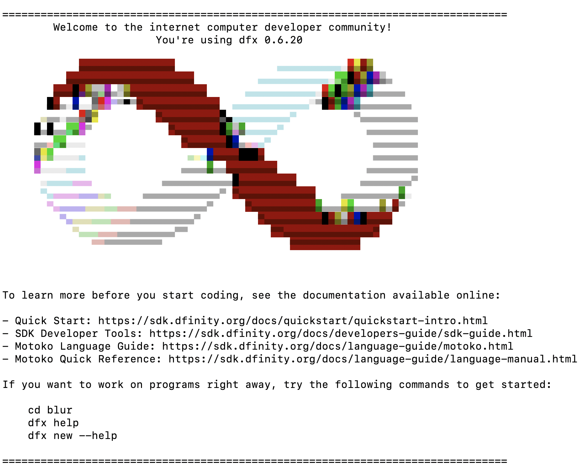
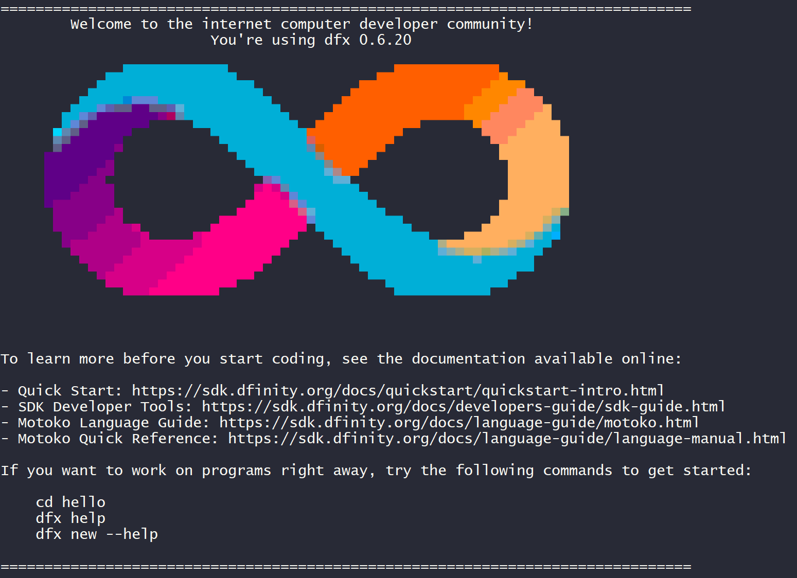

# First look at programming for DFINITY

Continuing our adventure exploring programmable Rust blockchains,
this time we're going to dive into [DFINITY].

[DFINITY]: https://github.com/dfinity

TODO

I have been vaguelly aware of DFINITY for a while,
but have thought it was not ready for a close look
since the GitHub seems to be missing the big pieces of a blockchain &mdash;
the full node does not appear to be open source yet.

I generally join any technical chat for Rust blockchain projects I follow.
I peek into [DFINITY's telegram][dt],
via the link on their website.
It's a typical non-technical blockchain chat,
filled with speculators.
I leave.

[dt]: https://t.me/dfinity/


## What we're going to do

For this first look we're going to install the tools and try to implement a contract
we've implemented before in solidity, near, and ink, [the big announcement][tba].

This is a simple program that lets the caller bid to set a singleton string message.


## Starting by doing some actual research!

Myself,
when I start a project,
I usually just jump in,
without informing myself of anything at all really.
Aimee though likes to read,
and watch,
and this time we have watched [an entire YouTube playlist][ytpl]
about "building on the Internet Computer".

[ytpl]: https://www.youtube.com/playlist?list=PLuhDt1vhGcrejCmYeB1uqgl9Y3f6MCyFp

It's an extremely basic series,
but I did have some takeaways:
mostly,
that programming for DFINITY appears to look a lot like traditional programming,
and _not_ like Solidity-descendant smart contract programming.
Gas was not mentioned at all,
and I am curious whether that means the programmer doesn't neeed to worry about gas,
or whether they chose to gloss over that subject.
They are using a custom smart contract language, [Motoko].
It looks like a mashup of a number of languages,
with some clear Rust influence,
though not one single obvious inspiration.
It is modeling its contract interactions as actors,
using the async/await model,
which so far appears to be a good fit.
The code I've seen in the video reads pretty easily.

[Motoko]: https://sdk.dfinity.org/docs/language-guide/motoko.html

I read a blog post by DFINITY's Johan Granström:
[A Closer Look at Software Canisters, an Evolution of Smart Contracts].

[canblog]: https://medium.com/dfinity/software-canisters-an-evolution-of-smart-contracts-internet-computer-f1f92f1bfffb

Many of the capabilities described here sound similar to other smart contract platforms.
A few that stand out to me though:

- The memory space of a wasm cannister is saved and restored every execution!
  This should makes it behave as if it were a long-running process,
  even though each invocation may be years apart,
  and on different nodes.
  There is apparently no explicit storage.
  This is pretty compelling,
  and I am surprised I haven't seen this done before in the smart contract space.
  It implies though that memory leaks live forever,
  and so does memory fragmentation.

- Full nodes are run by data centers.
  This probably allows it to be fast and store a lot of data,
  but reduces the decentralization.
  This is probably the fate of all smart contract blockchains though &mdash;
  Ethereum is already too big for most people to run on their own.
  It's not clear if full nodes need permission to join the network.

- Still no mention on gas!

I read another post by DFINITY's TODO

TODO

https://medium.com/dfinity/announcing-internet-computer-mainnet-and-a-20-year-roadmap-790e56cbe04a


## Installing the tools

Following the [quick start docs][qsd].

[qsd]: https://sdk.dfinity.org/docs/quickstart/quickstart-intro.html

I'm doing [local development][ldev],
not connecting to any testnet.

[ldev]: https://sdk.dfinity.org/docs/quickstart/local-quickstart.html

The tools are installed via `ssh`,
which is common and I am fine with:

I run the installation and see:

```
$ sh -ci "$(curl -fsSL https://sdk.dfinity.org/install.sh)"
Executing DFINITY SDK install script, commit: 55f1bbedee393411e1ae3a6eaeb449a6dd047c00
The DFINITY Canister SDK
Copyright 2021 DFINITY Stiftung. All Rights Reserved.
The DFINITY Canister SDK (the "Software") is licensed under the Alpha DFINITY
Canister SDK License Agreement (the "License"). You may not use the Software
except in compliance with the License. You may obtain a copy of the License at
    https://sdk.dfinity.org/sdk-license-agreement.txt
The Software is provided to you AS IS and WITHOUT WARRANTY.
Do you agree and wish to install the DFINITY Canister SDK [y/N]?
```

Huh.
They have a non-standard license.
I read it.

It doesn't load as text in my browser,
so it might not in others.
Here's a gist:

> [https://gist.github.com/brson/7abc2be6f9d8e2daf488512af2a866b7](https://gist.github.com/brson/7abc2be6f9d8e2daf488512af2a866b7)

It's not a free-software license.

It is called the "Alpha DFINITY ..." license,
so charitably I am assuming this is a temporary license,
and it will change to open source in the future.
There terms in it are ominous enough that,
if I weren't here to try it out,
I would stop immediately.

There's another issue here &mdash;
this text claims

> "The DFINITY Canister SDK is licensed under the Alpha DFINITY
  Canister SDK License Agreement"

Also, the source for at least _part_ of the Cannister SDK
lives [on GitHub][cdk-rs],
and claims to be Apache-2.0 licensed.

[cdk-rs]: https://github.com/dfinity/cdk-rs

Anyway,
noted.

Just to make sure it _is_ possible to opt out at this
stage of the script,
I hit _enter_,
which should default to not accepting the license
(that is what the "y/N" convention means &mdash
"N" is the default).

Huh.

Instead of accepting _enter_ as "no",
it said this:

```
Answer with a yes or no to continue. [y/N]
```

So I don't get the default-"N".

I hit enter again.

It says the following and exits:

```
Please accept the license to continue.
```

So the first time,
the script ignored the capital-letter-is-default convention,
while still recognizing I didn't entery "y";
then the second time it accepted the default.

I can kind of imagine the reasoning here:
"maybe they didn't _mean_ to not accept the license &dash;
let's give the user another change";
but the inconsistent application of the convention here
is confusing.

Anyway, now I run it again and enter "y".

The install script shows the following and exits:

```
Version found: 0.6.20
Creating uninstall script in ~/.cache/dfinity
uninstall path=/home/ubuntu/.cache/dfinity/uninstall.sh
Checking for latest release...
Will install in: /home/ubuntu/bin
Installed /home/ubuntu/bin/dfx
```

This looks pretty standard.

It's curious that it first said the version it found,
then later said it was checking for the latest release.
Didn't it already do that in order to find the version?

I read the uninstall script and I don't see any
obviously catastrophic bugs.
It does mention a `DFX_INSTALLATION_ROOT` environment
variable that I don't yet know anything about.

I run the uninstall script.
It works,
though provides no feedback.

I install again.

`dfx` is not immediatly in my `PATH`.
The install script or the docs could do a bit better
in guiding the user here.
I know from experience that this first
step of getting `PATH` set correctly is a very common
blocker for newbies.
Unfortunately there are no perfect technical solutions
to setting up `PATH` across all platforms,
so informing the user about it has to be part of the install
experience.

I am on Linux.
On Aimee's Mac though `dfx` is immediately on the path.
This is because the installer installed directly to
`/usr/local/bin`.
This creeps me out a bit
as I am accustomed to needing to `sudo` to write to that location.
Maybe it's common on Macs to install directly to `/usr/local/bin`
without permission.
On Linux, my `dfx` is in `~/bin`.

The next step is to install a VSCode plugin.
I don't use VSCode,
so I skip it.


## Aimee upgrades her `dfx`

Aimee has previously installed `dfx`.
Today when she ran `dfx new firsttest` to create a DFINITY project,
she had a confusing experience.

This is what she saw:

```
$ dfx new firsttest

The DFINITY Canister SDK sends anonymous usage data to DFINITY Stiftung by
default. If you wish to disable this behavior, then please set the environment
variable DFX_TELEMETRY_DISABLED=1. Learn more at https://sdk.dfinity.org.

Fetching manifest https://sdk.dfinity.org/manifest.json
⠋ Checking for latest dfx version...
You seem to be running an outdated version of dfx.

You are strongly encouraged to upgrade by running 'dfx upgrade'!
  Version v0.6.20 installed successfully.
Creating new project "firsttest"...
CREATE       firsttest/src/firsttest_assets/assets/sample-asset.txt (24B)...
CREATE       firsttest/src/firsttest/main.mo (107B)...
CREATE       firsttest/dfx.json (484B)...
CREATE       firsttest/.gitignore (165B)...
⠐ Checking for latest dfx version...
CREATE       firsttest/src/firsttest_assets/public/index.js (149B)...
CREATE       firsttest/package.json (288B)...
CREATE       firsttest/webpack.config.js (2.15KB)...
⠉ Checking for latest dfx version...
⠒ Checking for latest dfx version...
⠠ Installing node dependencies...
⠤ Checking for latest dfx version...
⠖ Installing node dependencies...

> fsevents@1.2.13 install /Users/aimeez/github/dfinity-project/firsttest/node_modules/watchpack-chokidar2/node_modules/fsevents
> node install.js
⠤ Checking for latest dfx version...
⠖ Checking for latest dfx version...
⠒ Checking for latest dfx version...
⠁ Checking for latest dfx version...
npm WARN firsttest_assets@0.1.0 No repository field.
npm WARN firsttest_assets@0.1.0 No license field.

⠙ Checking for latest dfx version...

13 packages are looking for funding
  run `npm fund` for details

found 1 high severity vulnerability
⠒ Checking for latest dfx version...
⠂ Checking for latest dfx version...

===============================================================================
        Welcome to the internet computer developer community!
                        You're using dfx 0.6.20

            ▄▄▄▄▄▄▄▄▄▄▄▄▄▄▄                ▄▄▄▄▄▄▄▄▄▄▄▄▄▄▄       
          ▄▄▄▄▄▄▄▄▄▄▄▄▄▄▄▄▄▄▄▄          ▄▄▄▄▄▄▄▄▄▄▄▄▄▄▄▄▄▄▄▄▄    
        ▄▄▄▄▄▄▄▄▄▄▄▄▄▄▄▄▄▄▄▄▄▄▄▄      ▄▄▄▄▄▄▄▄▄▄▄▄▄▄▄▄▄▄▄▄▄▄▄▄▄  
       ▄▄▄▄▄▄▄▄▄▄▀▀▀▀▀▄▄▄▄▄▄▄▄▄▄▄▄  ▄▄▄▄▄▄▄▄▄▄▄▄▀▀▀▀▀▀▄▄▄▄▄▄▄▄▄▄ 
      ▄▄▄▄▄▄▄▄▀         ▀▄▄▄▄▄▄▄▄▄▄▄▄▄▄▄▄▄▄▄▄▀         ▀▄▄▄▄▄▄▄▄▄
     ▄▄▄▄▄▄▄▄▀            ▀▄▄▄▄▄▄▄▄▄▄▄▄▄▄▄▄▀             ▄▄▄▄▄▄▄▄
     ▄▄▄▄▄▄▄▄               ▀▄▄▄▄▄▄▄▄▄▄▄▄▀                ▄▄▄▄▄▄▄
     ▄▄▄▄▄▄▄▄                ▄▄▄▄▄▄▄▄▄▄▄▄                 ▄▄▄▄▄▄▄
     ▄▄▄▄▄▄▄▄               ▄▄▄▄▄▄▄▄▄▄▄▄▄▄▄              ▄▄▄▄▄▄▄▄
      ▄▄▄▄▄▄▄▄           ▄▄▄▄▄▄▄▄▄▄▄▄▄▄▄▄▄▄▄▄▄          ▄▄▄▄▄▄▄▄▀
      ▀▄▄▄▄▄▄▄▄▄▄     ▄▄▄▄▄▄▄▄▄▄▄▄▀ ▀▄▄▄▄▄▄▄▄▄▄▄▄    ▄▄▄▄▄▄▄▄▄▄▄ 
       ▀▄▄▄▄▄▄▄▄▄▄▄▄▄▄▄▄▄▄▄▄▄▄▄▄▀     ▀▄▄▄▄▄▄▄▄▄▄▄▄▄▄▄▄▄▄▄▄▄▄▄▀  
         ▀▄▄▄▄▄▄▄▄▄▄▄▄▄▄▄▄▄▄▄▄▀         ▀▄▄▄▄▄▄▄▄▄▄▄▄▄▄▄▄▄▄▄▄    
           ▀▄▄▄▄▄▄▄▄▄▄▄▄▄▄▄▀▀             ▀▀▄▄▄▄▄▄▄▄▄▄▄▄▄▄▀      
              ▀▀▀▀▀▀▀▀▀▀▀                    ▀▀▀▀▀▀▀▀▀▀▀         
     


To learn more before you start coding, see the documentation available online:

- Quick Start: https://sdk.dfinity.org/docs/quickstart/quickstart-intro.html
- SDK Developer Tools: https://sdk.dfinity.org/docs/developers-guide/sdk-guide.html
- Motoko Language Guide: https://sdk.dfinity.org/docs/language-guide/motoko.html
- Motoko Quick Reference: https://sdk.dfinity.org/docs/language-guide/language-manual.html

If you want to work on programs right away, try the following commands to get started:

    cd firsttest
    dfx help
    dfx new --help

===============================================================================
```

This is a mess.

Several things appear to be going wrong here.

- The command has printed "you are strongly encouraged to upgrade by running 'dfx upgrade',
  then it goes on to just do the upgrade on its own, saying
  "Version v0.6.0 installed successfully".

- Ever after checking for and installing a `dfx` upgrade,
  some process continues "Checking for latest dfx version".

- The `dfx` version check is happening _in parallel_
  to the creation and build of the "firsttest" project,
  causing a confusing interleaving of messages.

- Even when not interrupted by other messages,
  the "Checking for latest dfx version" message,
  which is accompanied by a unicode spinner,
  and should only appear once while the spinner changes,
  is printed repeatedly.

- The "found 1 high severity vulnerability" message
  gives the impression that this code is not maintained.

After some careful reading we think we understand everything that happened.

We note that Aimee _already had_ version `dfx` 0.6.20 installed,
but that `dfx` said it updated to 0.6.20.
We don't know if anything changed about `dfx` or if it just got
confused and reinstalled itself.

We try the suggested `dfx upgrade`,
and as we expected it does nothing.
So `dfx new firsttest` suggested we run a command,
then ran that command for us,
and when we ran the suggested command,
it did nothing.

Now we are curious about how the output of `dfx new firsttest`
will change if we run it again,
without requiring an update,
so we delete the new "firsttest" directory and try again:

```
$ dfx new firsttest
Fetching manifest https://sdk.dfinity.org/manifest.json
Creating new project "firsttest"...
CREATE       firsttest/src/firsttest_assets/assets/sample-asset.txt (24B)...
CREATE       firsttest/src/firsttest/main.mo (107B)...
CREATE       firsttest/dfx.json (484B)...
CREATE       firsttest/.gitignore (165B)...
CREATE       firsttest/README.md (1.16KB)...
CREATE       firsttest/src/firsttest_assets/public/index.js (149B)...
CREATE       firsttest/package.json (288B)...
CREATE       firsttest/webpack.config.js (2.15KB)...
⠒ Installing node dependencies...
⠁ Installing node dependencies...
npm WARN deprecated resolve-url@0.2.1: https://github.com/lydell/resolve-url#deprecated
⠁ Installing node dependencies...
⠋ Installing node dependencies...

> fsevents@1.2.13 install /Users/aimeez/github/dfinity-project/firsttest/node_modules/watchpack-chokidar2/node_modules/fsevents
> node install.js
⠒ Installing node dependencies...
⠲ Installing node dependencies...
⠉ Installing node dependencies...
⠲ Installing node dependencies...
npm WARN firsttest_assets@0.1.0 No repository field.
npm WARN firsttest_assets@0.1.0 No license field.

⠄ Installing node dependencies...

13 packages are looking for funding
  run `npm fund` for details

found 1 high severity vulnerability
⠄ Installing node dependencies...


   ╭─────────────────────────────────────────────────────────────────╮
   │                                                                 │
   │      New patch version of npm available! 6.14.8 → 6.14.11       │
   │   Changelog: https://github.com/npm/cli/releases/tag/v6.14.11   │
   │                Run npm install -g npm to update!                │
   │                                                                 │
   ╰─────────────────────────────────────────────────────────────────╯
  Done.
Creating git repository...

===============================================================================
        Welcome to the internet computer developer community!
                        You're using dfx 0.6.20

            ▄▄▄▄▄▄▄▄▄▄▄▄▄▄▄                ▄▄▄▄▄▄▄▄▄▄▄▄▄▄▄       
          ▄▄▄▄▄▄▄▄▄▄▄▄▄▄▄▄▄▄▄▄          ▄▄▄▄▄▄▄▄▄▄▄▄▄▄▄▄▄▄▄▄▄    
        ▄▄▄▄▄▄▄▄▄▄▄▄▄▄▄▄▄▄▄▄▄▄▄▄      ▄▄▄▄▄▄▄▄▄▄▄▄▄▄▄▄▄▄▄▄▄▄▄▄▄  
       ▄▄▄▄▄▄▄▄▄▄▀▀▀▀▀▄▄▄▄▄▄▄▄▄▄▄▄  ▄▄▄▄▄▄▄▄▄▄▄▄▀▀▀▀▀▀▄▄▄▄▄▄▄▄▄▄ 
      ▄▄▄▄▄▄▄▄▀         ▀▄▄▄▄▄▄▄▄▄▄▄▄▄▄▄▄▄▄▄▄▀         ▀▄▄▄▄▄▄▄▄▄
     ▄▄▄▄▄▄▄▄▀            ▀▄▄▄▄▄▄▄▄▄▄▄▄▄▄▄▄▀             ▄▄▄▄▄▄▄▄
     ▄▄▄▄▄▄▄▄               ▀▄▄▄▄▄▄▄▄▄▄▄▄▀                ▄▄▄▄▄▄▄
     ▄▄▄▄▄▄▄▄                ▄▄▄▄▄▄▄▄▄▄▄▄                 ▄▄▄▄▄▄▄
     ▄▄▄▄▄▄▄▄               ▄▄▄▄▄▄▄▄▄▄▄▄▄▄▄              ▄▄▄▄▄▄▄▄
      ▄▄▄▄▄▄▄▄           ▄▄▄▄▄▄▄▄▄▄▄▄▄▄▄▄▄▄▄▄▄          ▄▄▄▄▄▄▄▄▀
      ▀▄▄▄▄▄▄▄▄▄▄     ▄▄▄▄▄▄▄▄▄▄▄▄▀ ▀▄▄▄▄▄▄▄▄▄▄▄▄    ▄▄▄▄▄▄▄▄▄▄▄ 
       ▀▄▄▄▄▄▄▄▄▄▄▄▄▄▄▄▄▄▄▄▄▄▄▄▄▀     ▀▄▄▄▄▄▄▄▄▄▄▄▄▄▄▄▄▄▄▄▄▄▄▄▀  
         ▀▄▄▄▄▄▄▄▄▄▄▄▄▄▄▄▄▄▄▄▄▀         ▀▄▄▄▄▄▄▄▄▄▄▄▄▄▄▄▄▄▄▄▄    
           ▀▄▄▄▄▄▄▄▄▄▄▄▄▄▄▄▀▀             ▀▀▄▄▄▄▄▄▄▄▄▄▄▄▄▄▀      
              ▀▀▀▀▀▀▀▀▀▀▀                    ▀▀▀▀▀▀▀▀▀▀▀         
     


To learn more before you start coding, see the documentation available online:

- Quick Start: https://sdk.dfinity.org/docs/quickstart/quickstart-intro.html
- SDK Developer Tools: https://sdk.dfinity.org/docs/developers-guide/sdk-guide.html
- Motoko Language Guide: https://sdk.dfinity.org/docs/language-guide/motoko.html
- Motoko Quick Reference: https://sdk.dfinity.org/docs/language-guide/language-manual.html

If you want to work on programs right away, try the following commands to get started:

    cd firsttest
    dfx help
    dfx new --help

===============================================================================
```

So nothing about checking for updates this time.
Good.
It still has a problem with its spinner+status message output,
where "Installing node dependencies..." is printed repeatedly.

This is on a Mac,
so perhaps it's a platform-specific bug.

The final thing that is striking about this command
is that it prints a massive welcome greeting:
huge logo, links to docs, basic commands.

This is perfectly fine for something on first run,
but I don't ever want to see this again.

It's obvious though that this is not something that happens only on first run,
since we've seen this message multiple times.

We notice one other problem with the banner:
it is not colored correctly on this terminal.



I've seen this banner in a 256 color terminal
and it is properly colored with a gradient.




I wonder if `dfx` is one of the tools with code available
under the GitHub org,
whether I can look at the code and try to fix some of these issues.

The only repo I see that might contain `dfx` is [cdk-rs].
I clone it and ripgrep for "dfx".

`dfx` is used by some test scripts here,
but I don't think the code for it is here.

[cdk-rs]: https://github.com/dfinity/cdk-rs


## Running a test cannister

The final step in the "local quickstart"
is to run a "hello world" cannister.

I run `dfx new hello` and see similar output to Aimee's.
I'm on Linux and I too see the duplicate status messages with spinners:

```
⠴ Installing node dependencies...
⠠ Installing node dependencies...
npm WARN deprecated resolve-url@0.2.1: https://github.com/lydell/resolve-url#deprecated
⠦ Installing node dependencies...
⠐ Installing node dependencies...
npm WARN optional SKIPPING OPTIONAL DEPENDENCY: fsevents@~2.3.1 (node_modules/chokidar/node_modules/fsevents):
```

Maybe node is printing empty lines here and that's causing the spinner to be interrupted,
or maybe it's somehow just from node printing a line.

The next step is to run a local devnet.

The instructions here are oddly rudimentary:

> "For example, you can do either of the following if running Terminal on macOS:

> Click Shell, then select New Tab to open a new terminal in your current
  working directory.

> Click Shell and select New Window, then run cd ~/ic-projects/hello in the new
  terminal if your hello project is in the ic-projects working folder."

This is how to open a new terminal tab or window,
but only on macOS.
And previously the instructions explained how to open a terminal,
but only on macOS:

> "For example, open Applications, Utilities, then double-click Terminal or press
  ⌘+spacebar to open Search, then type terminal."

I do appreciate accounting for all questions a newbie might have,
but this is assuming that the target audience is somebody who wants to program
for the blockchain,
but doesn't know how to open a terminal.
I think most development tutorials will just list "know how to open a termal"
as a prerequisit,
and maybe link to outside documentation.
It's not really the role of the docs here to explain how to open applications on a mac.

There may be some assumption here that Linux users know more about how to operate a terminal
than macOS users,
which could lead to the instructions glossing over how to configure `PATH`
(which just works on macOS),
while also including very detailed instructions for operating the terminal application.
Or maybe the assumption is just that more developers are doing their local hacking
on macOS.

Or maybe the writer was just using a Mac.

Anyway, in this text:

> "Click Shell, then select New Tab to open a new terminal in your current
  working directory.

> Click Shell and select New Window, then run cd ~/ic-projects/hello in the new
  terminal if your hello project is in the ic-projects working folder."

This is presenting two alternatives,
but only one includes instructions for changing directories to the project folder;
and this is the first mention of `~/ic-projects` &mdash;
the `dfx new hello` instructions didn't say anything about it.

I don't notice the instruction that `dfx start` needs to be run inside
the project folder,
probably because that instruction is buried inside the instruction for how
operate the macOS terminal.

So I run `dfx start` in the wrong folder:

```
dfx start
Cannot find dfx configuration file in the current working directory. Did you forget to create one?
```

`dfx` speculates that I forgot to create a "dfx configuration file"
(which I don't know anything about yet, but is appears to be called `dfx.json`).
Its speculation is incorrect.
I created it, indirectly;
I'm just not in the right folder.

Is forgetting to create a `dfx.json` file the most common explanation for this error?

Suggestions from developer tools can be awesome when they are 100% right.
They can be infuriating when they are wrong.

(I enter a momentary reverie about the times `rustc` or `clippy` have made wrong suggestions).

Here's the comparable `cargo` error:

```
error: could not find `Cargo.toml` in `/home/ubuntu/dfinity/hello` or any parent directory
```

I get the filename its looking for,
and no attempt to guess why it's missing.
I also get the directory it's looking in,
which on consideration I think is pretty thoughtful &mdash;
I have on multiple occassions seen less experienced developers
take a surprisingly long time after these types of errors to check what directory
they are actually in,
and this puts that information right in front of them.

I run `dfx start` in the correct folder:

```
$ dfx start
Jan 24 18:15:14.129 INFO ic-starter. Configuration: ValidatedConfig { replica_path: Some("/home/ubuntu/.cache/dfinity/versions/0.6.20/replica"), replica_version: "0.1.0", log_level: Warning, subnet_id: fscpm-uiaaa-aaaaa-aaaap-yai, cargo_bin: "cargo", cargo_opts: "", state_dir: "/home/ubuntu/dfinity/hello/.dfx/state/replicated_state", http_listen_addr: V4(127.0.0.1:0), http_port_file: Some("/home/ubuntu/dfinity/hello/.dfx/replica-configuration/replica-1.port"), metrics_addr: None, hypervisor_create_funds_whitelist: "*", artifact_pool_dir: "/home/ubuntu/dfinity/hello/.dfx/state/replicated_state/node-100/ic_consensus_pool", crypto_root: "/home/ubuntu/dfinity/hello/.dfx/state/replicated_state/node-100/crypto", state_manager_root: "/home/ubuntu/dfinity/hello/.dfx/state/replicated_state/node-100/state", registry_file: "/home/ubuntu/dfinity/hello/.dfx/state/replicated_state/registry.proto", bootstrap_registry: None, state_dir_holder: None }, Application: starter
Jan 24 18:15:14.129 INFO Initialize replica configuration "/home/ubuntu/dfinity/hello/.dfx/state/replicated_state/ic.json5", Application: starter
Jan 24 18:15:14.536 ERRO s:fscpm-uiaaa-aaaaa-aaaap-yai/n:eq5dc-p6wlh-rvwea-wfxrq-fqewv-n4q4v-k22qr-awprk-mcqa5-vjyrh-aqe/ic_messaging/xnet_endpoint No XNet configuration for node eq5dc-p6wlh-rvwea-wfxrq-fqewv-n4q4v-k22qr-awprk-mcqa5-vjyrh-aqe. This is an error in production, but may be ignored in single-subnet test deployments.
Jan 24 18:15:15.537 WARN s:fscpm-uiaaa-aaaaa-aaaap-yai/n:eq5dc-p6wlh-rvwea-wfxrq-fqewv-n4q4v-k22qr-awprk-mcqa5-vjyrh-aqe/ic_http_handler/ic_http_handler NNS subnet not found in network topology. Skipping fetching the delegation.
Starting webserver on port 42067 for replica at "http://localhost:42067"
binding to: V4(127.0.0.1:8000)
replica(s): http://localhost:42067/
Jan 24 18:17:52.946 WARN s:fscpm-uiaaa-aaaaa-aaaap-yai/n:eq5dc-p6wlh-rvwea-wfxrq-fqewv-n4q4v-k22qr-awprk-mcqa5-vjyrh-aqe/ic_state_layout/utils StateManager runs on a filesystem not supporting reflinks (attempted to reflink /home/ubuntu/dfinity/hello/.dfx/state/replicated_state/node-100/state/tip/subnet_queues.pbuf => /home/ubuntu/dfinity/hello/.dfx/state/replicated_state/node-100/state/fs_tmp/scratchpad_0000000000000064/subnet_queues.pbuf), running big canisters can be very slow
```

Oof, this is a mouthful.

Here's what it looks like wrapped in my terminal:

```
$ dfx start
Jan 24 18:15:14.129 INFO ic-starter. Configuration: ValidatedConfig { replica_path: Some("/home/ubuntu/.cache/dfinity/versions/0.6.20/
replica"), replica_version: "0.1.0", log_level: Warning, subnet_id: fscpm-uiaaa-aaaaa-aaaap-yai, cargo_bin: "cargo", cargo_opts: "", s
tate_dir: "/home/ubuntu/dfinity/hello/.dfx/state/replicated_state", http_listen_addr: V4(127.0.0.1:0), http_port_file: Some("/home/ubu
ntu/dfinity/hello/.dfx/replica-configuration/replica-1.port"), metrics_addr: None, hypervisor_create_funds_whitelist: "*", artifact_po
ol_dir: "/home/ubuntu/dfinity/hello/.dfx/state/replicated_state/node-100/ic_consensus_pool", crypto_root: "/home/ubuntu/dfinity/hello/
.dfx/state/replicated_state/node-100/crypto", state_manager_root: "/home/ubuntu/dfinity/hello/.dfx/state/replicated_state/node-100/sta
te", registry_file: "/home/ubuntu/dfinity/hello/.dfx/state/replicated_state/registry.proto", bootstrap_registry: None, state_dir_holde
r: None }, Application: starter
Jan 24 18:15:14.129 INFO Initialize replica configuration "/home/ubuntu/dfinity/hello/.dfx/state/replicated_state/ic.json5", Applicati
on: starter
Jan 24 18:15:14.536 ERRO s:fscpm-uiaaa-aaaaa-aaaap-yai/n:eq5dc-p6wlh-rvwea-wfxrq-fqewv-n4q4v-k22qr-awprk-mcqa5-vjyrh-aqe/ic_messaging/
xnet_endpoint No XNet configuration for node eq5dc-p6wlh-rvwea-wfxrq-fqewv-n4q4v-k22qr-awprk-mcqa5-vjyrh-aqe. This is an error in prod
uction, but may be ignored in single-subnet test deployments.
Jan 24 18:15:15.537 WARN s:fscpm-uiaaa-aaaaa-aaaap-yai/n:eq5dc-p6wlh-rvwea-wfxrq-fqewv-n4q4v-k22qr-awprk-mcqa5-vjyrh-aqe/ic_http_handl
er/ic_http_handler NNS subnet not found in network topology. Skipping fetching the delegation.
Starting webserver on port 42067 for replica at "http://localhost:42067"
binding to: V4(127.0.0.1:8000)
replica(s): http://localhost:42067/
Jan 24 18:17:52.946 WARN s:fscpm-uiaaa-aaaaa-aaaap-yai/n:eq5dc-p6wlh-rvwea-wfxrq-fqewv-n4q4v-k22qr-awprk-mcqa5-vjyrh-aqe/ic_state_layo
ut/utils StateManager runs on a filesystem not supporting reflinks (attempted to reflink /home/ubuntu/dfinity/hello/.dfx/state/replica
ted_state/node-100/state/tip/subnet_queues.pbuf => /home/ubuntu/dfinity/hello/.dfx/state/replicated_state/node-100/state/fs_tmp/scratc
hpad_0000000000000064/subnet_queues.pbuf), running big canisters can be very slow
```

Frankly, it looks like junk:
debug printing,
huge wrapped lines,
extremely long identifiers,
inconsistent formatting,
inconsistent language.
It's unscannable spew.

Some of the lines here are not log lines,
but are just output straight to the console,
and have a different format.

There's an error here that explains that it is actually not an error.

Here's what a substrate node looks like when it launches:

```
2020-11-25 00:05:57  Running in --dev mode, RPC CORS has been disabled.
2020-11-25 00:05:57  Canvas Node
2020-11-25 00:05:57  ✌️  version 0.1.0-e189090-x86_64-linux-gnu
2020-11-25 00:05:57  ❤️  by Canvas, 2020-2020
2020-11-25 00:05:57  📋 Chain specification: Development
2020-11-25 00:05:57  🏷 Node name: somber-thread-7554
2020-11-25 00:05:57  👤 Role: AUTHORITY
2020-11-25 00:05:57  💾 Database: RocksDb at /tmp/substrateBjvYLz/chains/dev/db
2020-11-25 00:05:57  ⛓  Native runtime: canvas-8 (canvas-0.tx1.au1)
2020-11-25 00:05:57  🔨 Initializing Genesis block/state (state: 0x76e4…0f61, header-hash: 0x70f1…6167)
2020-11-25 00:05:57  👴 Loading GRANDPA authority set from genesis on what appears to be first startup.
2020-11-25 00:05:57  ⏱  Loaded block-time = 6000 milliseconds from genesis on first-launch
2020-11-25 00:05:57  Using default protocol ID "sup" because none is configured in the chain specs
2020-11-25 00:05:57  🏷 Local node identity is: 12D3KooWDdvLqPW8gzaPBWgYjd6Q2yC2abk6713QykMfVAGHVtfr
2020-11-25 00:05:57  📦 Highest known block at #0
2020-11-25 00:05:57  〽️ Prometheus server started at 127.0.0.1:9615
2020-11-25 00:05:57  Listening for new connections on 127.0.0.1:9944.
2020-11-25 00:06:00  🙌 Starting consensus session on top of parent 0x70f1a0488a744075c07ca30d890d981697ffff0c2ef024e9753b9152afd46167
2020-11-25 00:06:00  🎁 Prepared block for proposing at 1 [hash: 0x50ff56ca14d680e03c3c1a2a231f27a1c4ffee2c52bba5a8459112f5a375c2ff; p
arent_hash: 0x70f1…6167; extrinsics (1): [0x115d…2969]]
2020-11-25 00:06:00  🔖 Pre-sealed block for proposal at 1. Hash now 0x0aee39eb04a2283232d41ca12ea1418f3215378455e2ea4e0e9312ec9455307
2, previously 0x50ff56ca14d680e03c3c1a2a231f27a1c4ffee2c52bba5a8459112f5a375c2ff.
2020-11-25 00:06:00  ✨ Imported #1 (0x0aee…3072)
```

This is pretty easy to scan for useful information.
On the console the timestamp is colored in such a way that,
even with some lines wrapping,
each log entry is easy to identify.

When a server starts logging,
as a newcomer the two thinngs usually I want to know are:

- Is it operating correctly?
- What ports is it listening on?

In my own software I generally try to make those the final pieces of information printed
before the server starts idling.

`dfx start` ends like this

```
$ dfx start
...
Jan 24 18:15:15.537 WARN s:fscpm-uiaaa-aaaaa-aaaap-yai/n:eq5dc-p6wlh-rvwea-wfxrq-fqewv-n4q4v-k22qr-awprk-mcqa5-vjyrh-aqe/ic_http_handl
er/ic_http_handler NNS subnet not found in network topology. Skipping fetching the delegation.
Starting webserver on port 42067 for replica at "http://localhost:42067"
binding to: V4(127.0.0.1:8000)
replica(s): http://localhost:42067/
Jan 24 18:17:52.946 WARN s:fscpm-uiaaa-aaaaa-aaaap-yai/n:eq5dc-p6wlh-rvwea-wfxrq-fqewv-n4q4v-k22qr-awprk-mcqa5-vjyrh-aqe/ic_state_layo
ut/utils StateManager runs on a filesystem not supporting reflinks (attempted to reflink /home/ubuntu/dfinity/hello/.dfx/state/replica
ted_state/node-100/state/tip/subnet_queues.pbuf => /home/ubuntu/dfinity/hello/.dfx/state/replicated_state/node-100/state/fs_tmp/scratc
hpad_0000000000000064/subnet_queues.pbuf), running big canisters can be very slow
...
```

And it's not all that clear.
Because there are two different output formats (log lines and regular printlns),
the three printlns,
which are probably the information the devs want me to see most,
are visually obscured in the line-wrapped log lines.
In the important printlns,
there are two addresses involved,
printed in three different ways.
Port 8000 is bound for something, but what?
We're told that a webserver for "replicas" is listening on port 42067,
twice,
with the port mentioned three times.
The first time we're told what's about to happen ("starting");
the last time it's implied that the port has successfully opened and is listening.
The port 8000 message again says what's about to happen ("binding to"),
but not that that port has successfully open and is listening.


## Aimee resumes her tutorial


Aimee, a day after deploying "hello",
comes back to the tutorial,
restarts here node with `dfx start`.
She realizes she no longer knows the ID
of the cannister she deployed yesterday.
This is information shee needs to open it in the web UI
at

```
http://127.0.0.1:8000/?canisterId=<...>
```

She finds that information in her terminal backscroll.
Probably we could have figured out how to query that information
otherwise.

Aimee finds this command hard to read:

```
dfx cannister call hello greet everyone
```

It makes sense to me,
knowing how CLI subcommands work,
and realizing "hello" is a contract,
"greet" is a method,
and "everyone" is an argument to that method.

Although I like how elegant this unfurling of sub-commands within sub-commands looks,
I do recognize that the lack of argument names means that the command itself contains
no meta-information about what "hello", "greet", and "everyone" are.

She finds it not clear where the CLI sub-commands end and there arguments begin,
expecting _some_ `--foo`-style arguments somewhere.

I like this command though :)

She takes the opportunity to explore the feedback she gets from the CLI if these
arguments are progresively added from `dfx cannister call`:

```
$ dfx canister call hello greet everyone
("Hello, everyone!")

$ dfx canister call 
error: The following required arguments were not provided:
    <canister-name>
    <method-name>

USAGE:
    dfx canister call [FLAGS] [OPTIONS] <canister-name> <method-name> [argument]

For more information try --help

$ dfx canister call hello
error: The following required arguments were not provided:
    <method-name>

USAGE:
    dfx canister call [FLAGS] [OPTIONS] <canister-name> <method-name> [argument]

For more information try --help

$ dfx canister call hello memememe
The Replica returned an error: code 3, message: "Canister rwlgt-iiaaa-aaaaa-aaaaa-cai has no update method 'memememe'"

$ dfx canister call hello greet
Invalid data: Unable to serialize Candid values: wrong number of argument values

$ dfx canister call hello greet memeememememme
("Hello, memeememememme!")
```

This is pretty helpful.
It is most helpful while the CLI is parsing known arguments.
When she accidentally forgets the "greet" method name,
the error does provide enough info to figure out what went wrong.
The errors that don't come from the command-line parser could be more consistent and helpful,
but I won't make specific observations here.


## TODO


First impressions are important.
Someone trying to run DFINITY right now
is seeing a lot of missing polish.

